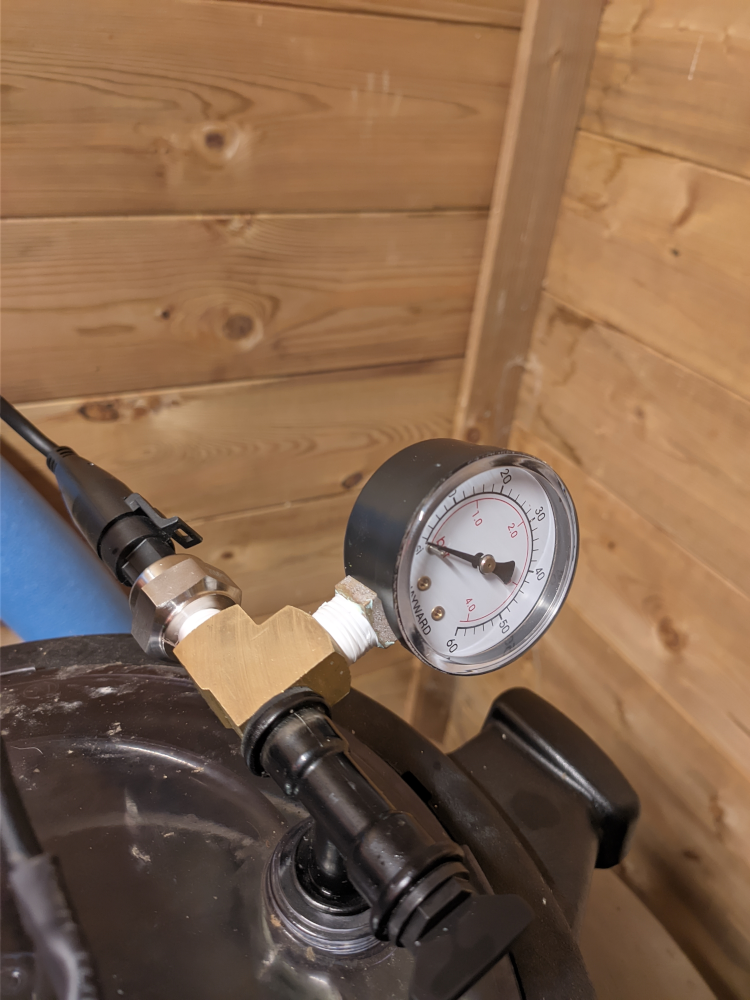

# Domopool

## Goal

The goal of this project is to automatise some parts of my pool, mainly the flter pump based on the water temperature. There is also an option to use a ph pump.

## Hardware

The base hardware is an esp32 devkitC.
Other hardware:

- arduitouch box: https://www.hwhardsoft.de/english/projects/arduitouch-esp/
- LCD: Ili9341 240x320 RGB
- Temperatures (water and ambiant): 2 DS18B20
- Water pressure: GS07381-06 (200PSI) [amazon](https://www.amazon.fr/gp/product/B07YZL36FN/ref=ppx_yo_dt_b_asin_title_o06_s00?ie=UTF8&psc=1)
- RTC: DS3231 [amazon](https://www.amazon.fr/gp/product/B07RDHPYJD/ref=ppx_yo_dt_b_asin_title_o08_s00?ie=UTF8&psc=1)
- ADC: ADS1115 [az-delivery](https://www.az-delivery.de/en/products/analog-digitalwandler-ads1115-mit-i2c-interface?_pos=1&_sid=04886a84e&_ss=r)
- LevelShifter: TXS0108E [az-delivery](https://www.az-delivery.de/en/products/logiklevel-wandler-3-3v-5v?_pos=1&_sid=a0a8086aa&_ss=r)
- Relay: 4-relay module 5V with optocoupler low-level trigger [az-delivery](https://www.az-delivery.de/en/products/4-relais-modul?_pos=2&_sid=34a975ef0&_ss=r)

### Pictures

- The box

- The pressure sensor on top of the sand filter

## Funtionalities

- Read/write configuration from preferences (nvs storage)
- Mesure water temperature, ambiant temperature and water pressure
- Auto-detect DS18B20 (temperature sensors)
- Avaluate filtering time based on day hour and water temperature
- Get/Set values through grpc request
- Set time with ntp
- Send data with mqtt
- alarms on temperatures and pressure
- frost protection
- low/high pressure protection

### Configuration

To ease configuration update 2 front-end are under developement:

- CLI: [https://github.com/golgoth31/domopool-cli](https://github.com/golgoth31/domopool-cli)
- UI: [https://github.com/golgoth31/domopool-cli/tree/master/web](https://github.com/golgoth31/domopool-cli/tree/master/web)

### Temp/filter time

The local table is defined like this:

| Temp  |Hour|0  |1  |2  |3  |4  |5  |6  |7  |8  |9  |10 |11 |12 |13 |14 |15 |16 |17 |18 |19 |20 |21 |22 |23 |
|-------|----|:-:|:-:|:-:|:-:|:-:|:-:|:-:|:-:|:-:|:-:|:-:|:-:|:-:|:-:|:-:|:-:|:-:|:-:|:-:|:-:|:-:|:-:|:-:|:-:|
|  t<1  |    | X | X | X | X | X | X | X | X | X | X | X | X | X | X | X | X | X | X | X | X | X | X | X | X |
|1<t<3  |    |   |   |   | X | X |   |   |   |   |   |   |   |   |   |   |   |   |   |   |   |   |   |   |   |
|3<t<6  |    |   |   |   | X | X |   |   |   |   |   |   |   |   |   |   |   |   |   |   |   |   |   |   |   |
|6<t<9  |    |   |   |   |   | X | X |   |   |   |   |   | X |   |   |   |   |   |   |   |   |   |   |   |   |
|9<t<12 |    |   |   |   |   |   |   |   |   | X | X | X | X |   |   |   |   |   |   |   |   |   |   |   |   |
|12<t<15|    |   |   |   |   |   |   |   |   | X | X | X |   |   |   | X | X |   |   |   |   |   |   |   |   |
|15<t<18|    |   |   |   |   |   |   |   |   | X | X | X |   |   |   | X | X | X |   |   |   |   |   |   |   |
|18<t<21|    |   |   |   |   |   |   |   |   | X | X | X | X |   |   | X | X | X |   |   |   |   |   |   |   |
|21<t<23|    |   |   |   |   |   |   |   |   | X | X | X | X |   |   | X | X | X | X |   |   |   |   |   |   |
|23<t<26|    |   |   |   | X | X |   |   |   | X | X | X | X |   |   | X | X | X | X | X |   |   |   |   |   |
|26<t<28|    |   |   |   | X | X | X |   |   | X | X | X | X |   |   | X | X | X | X | X | X |   |   |   |   |
|28<t<30|    |   |   |   | X | X | X | X |   | X | X | X | X |   |   | X | X | X | X | X | X | X |   |   |   |
|30<t   |    | X | X | X | X | X | X | X | X | X | X | X | X | X | X | X | X | X | X | X | X | X | X | X | X |

Other table exemples:

- from [1](https://pool-technologie.com/fichiers/spec_telechargement/MANUEL%20SIMPLEO-FR.pdf)

- from [https://www.piscine-center.net/gestion-de-la-filtration-et-de-l-electrolyseur.html](https://www.piscine-center.net/gestion-de-la-filtration-et-de-l-electrolyseur.html)

    

- from [https://www.perfeco-f.fr/index.php/le-perfeco](https://www.perfeco-f.fr/index.php/le-perfeco)

    

## ToDo

- set hour if ntp and rtc are not ok
- add Hbridge driver for peristaltic pump (ph)
- add ability to redefine filter pump steps
